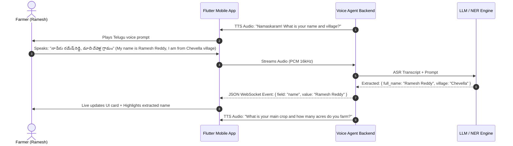
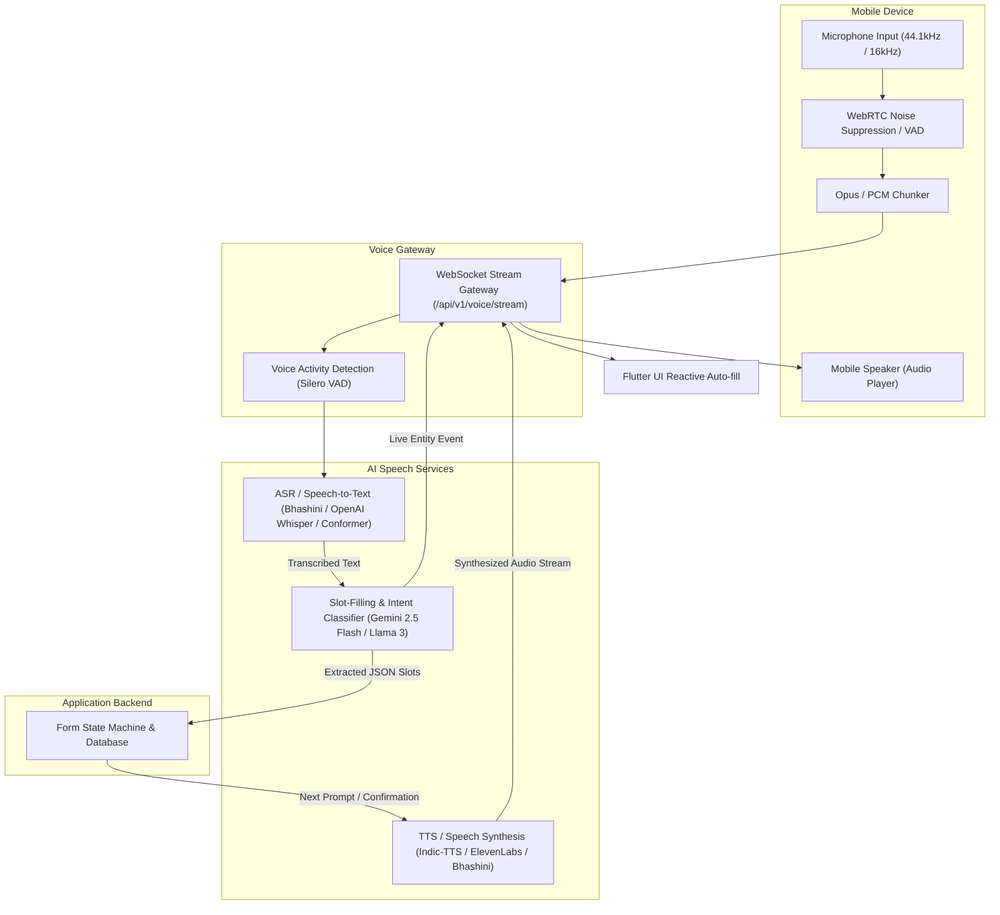

# 🎙️ AgriConnect: Vernacular Voice AI Agent — Requirements & Architecture Specification

> **Feature Name**: Multilingual Conversational Voice Agent (Voice-to-Form & Agricultural Assistant)  
> **Platform**: AgriConnect (Smart India Hackathon 2026 - SIH26033)  
> **Document Purpose**: Complete technical and architectural specification to implement the Speech-to-Text (STT), Natural Language Understanding (NLU/NER), Intent Classification, Dialog State Management, and Text-to-Speech (TTS) Voice Agent backend and client pipelines.

---

## 📑 Table of Contents
1. [Executive Summary & Problem Statement](#1-executive-summary--problem-statement)
2. [Target Languages & Regional Accents](#2-target-languages--regional-accents)
3. [Core Use Cases & Dialogue Flows](#3-core-use-cases--dialogue-flows)
   - 3.1 Farmer Voice Onboarding (`voice_registration`)
   - 3.2 Produce Listing via Voice (`voice_produce_listing`)
   - 3.3 Mandi Price & Weather Query Assistant (`voice_advisory`)
4. [Voice Processing Pipeline & Architecture](#4-voice-processing-pipeline--architecture)
5. [Entity Extraction & Slot-Filling Schema](#5-entity-extraction--slot-filling-schema)
6. [API Contracts & Protocols (REST & WebSocket Streaming)](#6-api-contracts--protocols-rest--websocket-streaming)
7. [Unit Conversions & Agricultural Vocabulary Normalizer](#7-unit-conversions--agricultural-vocabulary-normalizer)
8. [Client-Side Audio & Mobile Requirements](#8-client-side-audio--mobile-requirements)
9. [Tech Stack & Recommended Cloud/Open-Source Services](#9-tech-stack--recommended-cloudopen-source-services)

---

## 1. Executive Summary & Problem Statement

### The Problem
A majority of smallholder Indian farmers encounter digital literacy hurdles when interacting with complex mobile UI forms (typing crop names, varieties, quantities in kilograms, geolocation, and expected prices).

### The Solution
AgriConnect's **Vernacular Voice Agent** allows farmers to converse naturally in their mother tongue (Telugu, Hindi, Marathi, etc.). The system:
1. Listens to continuous audio streaming from the farmer's mobile microphone.
2. Transcribes regional dialects using Speech-to-Text (STT / ASR) models (Bhashini / Whisper / IndicASR).
3. Extracts key agricultural entities (crop name, quantity, unit, price, location, harvest date) via Named Entity Recognition (NER) & LLM slot-filling.
4. Auto-fills the registration/produce listing forms in real time on the UI with visual feedback.
5. Speaks back questions or confirmations in natural vernacular audio using Text-to-Speech (TTS).

---

## 2. Target Languages & Regional Accents

| Language | BCP-47 Code | Primary Regions / Mandis | Speech Engine Support |
| :--- | :--- | :--- | :--- |
| **Telugu (తెలుగు)** | `te-IN` | Telangana, Andhra Pradesh (Chevella, Khammam, Guntur) | Bhashini / IndicASR / Google STT |
| **Hindi (हिन्दी)** | `hi-IN` | Madhya Pradesh, Uttar Pradesh, Rajasthan, Bihar | Bhashini / Whisper / Google STT |
| **Marathi (मराठी)** | `mr-IN` | Maharashtra (Nashik, Pune, Aurangabad Mandis) | Bhashini / IndicASR / Google STT |
| **Tamil (தமிழ்)** | `ta-IN` | Tamil Nadu (Coimbatore, Madurai) | Bhashini / IndicASR |
| **Kannada (ಕನ್ನಡ)** | `kn-IN` | Karnataka (Kolar, Shimoga) | Bhashini / IndicASR |
| **English (Indian)**| `en-IN` | Pan-India Institutional Buyers & Coordinators | Whisper Large v3 / Google STT |

---

## 3. Core Use Cases & Dialogue Flows

### 3.1 Farmer Voice Onboarding (`voice_registration`)



---

### 3.2 Produce Listing via Voice (`voice_produce_listing`)

#### Typical Dialogue:
- **Agent**: *"What crop do you want to list and how much quantity?"*
- **Farmer**: *"20 bags of Sona Masoori rice, around 10 quintals ready this Friday."*
- **Agent**: *"Got it! 1,000 kg Sona Masoori Rice. What is your expected price per kilo?"*
- **Farmer**: *"Expecting ₹26 per kilo."*
- **Agent**: *"Listing 1,000 kg Sona Masoori at ₹26/kg for pickup from Chevella on Friday. Shall I confirm?"*
- **Farmer**: *"Yes, confirm."*

---

## 4. Voice Processing Pipeline & Architecture



---

## 5. Entity Extraction & Slot-Filling Schema

When a farmer speaks, the NLU engine parses utterances into structured JSON according to this schema:

### Master Entity Extraction Schema
```json
{
  "$schema": "http://json-schema.org/draft-07/schema#",
  "title": "VoiceExtractedEntities",
  "type": "object",
  "properties": {
    "intent": {
      "type": "string",
      "enum": [
        "farmer_registration",
        "create_produce_listing",
        "update_produce_listing",
        "query_market_price",
        "check_order_status",
        "request_advisory",
        "confirm_action",
        "cancel_action"
      ]
    },
    "language_detected": {
      "type": "string",
      "example": "te-IN"
    },
    "entities": {
      "type": "object",
      "properties": {
        "farmer_name": { "type": "string", "nullable": true },
        "phone_number": { "type": "string", "nullable": true },
        "village": { "type": "string", "nullable": true },
        "mandal": { "type": "string", "nullable": true },
        "district": { "type": "string", "nullable": true },
        "state": { "type": "string", "nullable": true },
        "land_size_acres": { "type": "number", "nullable": true },
        "crop_name": {
          "type": "string",
          "enum": ["Tomato", "Wheat", "Paddy", "Onion", "Potato", "Chilli", "Cotton", "Maize", "Soybean", "Turmeric"],
          "nullable": true
        },
        "crop_variety": { "type": "string", "nullable": true },
        "raw_quantity_value": { "type": "number", "nullable": true },
        "raw_quantity_unit": { 
          "type": "string", 
          "enum": ["kg", "quintal", "ton", "bag", "crate", "bori", "maund", "patti"],
          "nullable": true 
        },
        "standardized_quantity_kg": { "type": "number", "nullable": true },
        "expected_price_per_kg": { "type": "number", "nullable": true },
        "harvest_date": { "type": "string", "format": "date", "nullable": true },
        "quality_grade": { 
          "type": "string", 
          "enum": ["gradeA", "gradeB", "gradeC"],
          "nullable": true 
        },
        "payment_mode_preference": { "type": "string", "nullable": true }
      }
    },
    "missing_required_slots": {
      "type": "array",
      "items": { "type": "string" },
      "example": ["expected_price_per_kg", "photos"]
    },
    "confidence_score": {
      "type": "number",
      "minimum": 0.0,
      "maximum": 1.0,
      "example": 0.94
    },
    "is_dialogue_complete": {
      "type": "boolean",
      "example": false
    },
    "next_agent_prompt": {
      "type": "object",
      "properties": {
        "text_en": { "type": "string" },
        "text_vernacular": { "type": "string" },
        "tts_audio_url": { "type": "string", "nullable": true }
      }
    }
  },
  "required": ["intent", "entities", "confidence_score", "is_dialogue_complete"]
}
```

---

## 6. API Contracts & Protocols (REST & WebSocket Streaming)

### 6.1 WebSocket Streaming Endpoint: `WS /api/v1/voice/stream`

Real-time, bidirectional audio communication for zero-lag conversational voice experiences.

#### Connection Query Parameters:
- `token`: Bearer JWT token
- `language`: `te-IN` | `hi-IN` | `mr-IN` | `en-IN`
- `session_id`: Unique onboarding/listing session UUID
- `flow`: `onboarding` | `produce_listing` | `assistant`

#### Client -> Server Message (Binary or JSON Chunk):
```json
{
  "event": "audio_chunk",
  "mime_type": "audio/webm;codecs=opus",
  "chunk_base64": "GkXfo59ChoEBQveBAULygQ8..."
}
```

#### Server -> Client Message (Real-Time Slot Update):
```json
{
  "event": "entity_extracted",
  "field": "standardized_quantity_kg",
  "display_label": "Quantity",
  "value": 1000.0,
  "formatted_text": "1,000 kg (10 Quintals)",
  "confidence": 0.96
}
```

#### Server -> Client Message (Agent TTS Audio Response):
```json
{
  "event": "agent_speech",
  "text": "1000 కిలోల టమోటా నమోదు చేయబడింది. కిలో ఎంత ధరకు అమ్మాలనుకుంటున్నారు?",
  "audio_format": "audio/mp3",
  "audio_base64": "SUQzBAAAAAAAI1RTU0UAAAAPAAADTGF2ZjU4Ljc2...",
  "is_final_step": false
}
```

---

### 6.2 REST Endpoint: Single-Shot Voice Upload

#### `POST /api/v1/ai/voice-parse`
For recorded audio clips (e.g., when the user holds down the mic button and releases).

- **Headers**: `Content-Type: multipart/form-data`
- **Form Data**:
  - `audio_file`: Binary file (`.wav`, `.m4a`, `.mp3`, `.ogg`)
  - `source_language`: `te-IN`
  - `intent_hint`: `create_produce_listing`

- **Response (200 OK)**:
```json
{
  "success": true,
  "transcribed_text": "నా దగ్గర 20 క్వింటాళ్ల సోనా మసూరి వరి ఉంది, కిలో 25 రూపాయలకు అమ్మాలనుకుంటున్నాను",
  "english_translation": "I have 20 quintals of Sona Masoori paddy, looking to sell at 25 rupees per kg",
  "extracted_entities": {
    "crop_name": "Paddy (Sona Masoori)",
    "variety": "Sona Masoori",
    "standardized_quantity_kg": 2000.0,
    "expected_price_per_kg": 25.0,
    "pickup_district": "Khammam"
  },
  "missing_slots": ["harvest_date", "photos"],
  "confidence": 0.95
}
```

---

## 7. Unit Conversions & Agricultural Vocabulary Normalizer

The backend normalizer converts regional colloquial units into standard metric kilograms:

| Vernacular Term (Telugu / Hindi / Marathi) | Local Meaning | Standardized Formula |
| :--- | :--- | :--- |
| **Quintal (క్వింటాల్ / क्विंटल)** | Standard wholesale lot | `1 Quintal = 100 kg` |
| **Tonne / Metric Ton (టన్ను / टन)** | Heavy truck consignment | `1 Ton = 1,000 kg` |
| **Bori / Bag (బోరి / కట్ట / बोरी / कट्टा)** | Jute/gunny sack of grain | `1 Grain Bag = 50 kg` (Wheat/Paddy) |
| **Crate (క్రేట్ / क्रेट)** | Plastic crate (Tomatoes/Veggies) | `1 Tomato Crate = 25 kg` |
| **Maund / Mann (మణుగు / मन)** | Traditional North/Central India unit | `1 Maund = 40 kg` |
| **Patti (పట్టి)** | Cluster wholesale lot | Variable (Default 500 kg) |
| **Acre (ఎకరం / एकड़)** | Land area | `1 Acre = 4,046.86 m²` |
| **Gunta (గుంట / गुंठा)** | Sub-acre land parcel | `1 Gunta = 1/40 Acre (101.17 m²)` |

---

## 8. Client-Side Audio & Mobile Requirements

### Mobile Device Specs & Permissions:
1. **Audio Recording Sample Rate**: 16,000 Hz (16 kHz), 16-bit Mono PCM (Optimal for Speech-to-Text).
2. **Audio Codec**: Opus / WebM / AAC for low bandwidth consumption over 3G/4G farm connectivity.
3. **Voice Activity Detection (VAD)**:
   - Client-side VAD silences background tractor/wind noise.
   - Automatically detects when farmer finishes speaking (silence duration > 1.2s) to trigger processing.
4. **Offline Resilience**:
   - If internet connectivity drops, recorded audio buffers locally and uploads once network reconnects.

---

## 9. Tech Stack & Recommended Cloud/Open-Source Services

| Component | Recommended Technology / API | Fallback Option |
| :--- | :--- | :--- |
| **Indic STT (Speech-to-Text)** | **AI4Bharat / Bhashini IndicASR** (Govt of India open-source) | Whisper Large v3 (Fine-tuned on Indic) / Google Speech API |
| **NLU / Slot-Filling** | **Gemini 2.5 Flash / Gemini Pro** (Few-shot JSON Schema) | Llama 3.3 70B Instruct / Mistral Indic |
| **Indic TTS (Text-to-Speech)** | **Bhashini Indic-TTS** (Natural regional human voices) | ElevenLabs Multilingual / Google Cloud TTS |
| **Streaming Gateway** | **FastAPI WebSockets + Python asyncio** | Node.js (NestJS + ws) |
| **Audio Preprocessing** | **Silero VAD + FFmpeg** | WebRTC VAD |

---
*AgriConnect Voice Agent Requirements Specification — SIH 2026*
