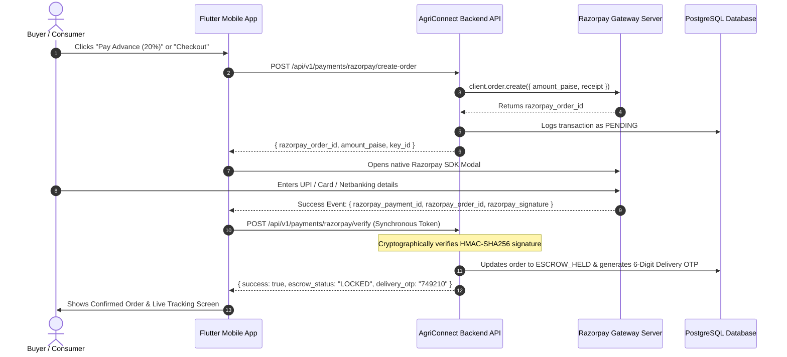

# 💳 AgriConnect: Complete Razorpay Payment Gateway & Escrow Integration Guide
## Synchronous Verification Architecture (Option 1 - Hackathon MVP & Production)

This guide provides the complete, end-to-end integration specifications for both the **Frontend Mobile Team (Flutter)** and the **Backend Engineering Team (FastAPI / Node.js)**. It implements **Synchronous Signature Verification** for instant, rock-solid payment processing without the complexity and latency of webhooks.

---

## 🏗️ Architecture & Payment Flow



---

## 🌍 Base URLs & Test Credentials

| Environment | Base URL |
| :--- | :--- |
| **Development** | `http://localhost:8000/api/v1` |
| **Production** | `https://agriconnect-api-fiz5.onrender.com/api/v1` |

### Razorpay Test Mode Credentials
* **Razorpay Key ID:** `rzp_test_agriconnect123` (or your registered test key)
* **Razorpay Key Secret:** `rzp_test_secret_agriconnect456`
* **Currency:** `INR` (Indian Rupee)

---

## 🚀 Step 1: Create Razorpay Order (Backend & Mobile)

Before displaying the payment gateway modal, the client must request a new `razorpay_order_id` from the AgriConnect backend.

### Endpoint: `POST /api/v1/payments/razorpay/create-order`
* **Headers:**
  ```http
  Authorization: Bearer <user_jwt_token>
  Content-Type: application/json
  ```

### Request Body (JSON)
```json
{
  "userId": "usr_99214a12",
  "amount": 500.00,
  "currency": "INR",
  "paymentType": "advance_20",
  "internalOrderId": "AGR-1024"
}
```

#### Supported `paymentType` values:
* `advance_20`: B2B Wholesale Buyer contract lock (20% Smart Escrow Advance).
* `final_80`: B2B Balance payout upon Mandi Gate quality inspection.
* `full_100`: B2C Household Consumer grocery cart checkout.

### Response 201 Created (JSON)
```json
{
  "success": true,
  "razorpay_order_id": "order_EKwxwAgItmmXdp",
  "transaction_id": "txn_881920",
  "amount": 50000,
  "currency": "INR",
  "key_id": "rzp_test_agriconnect123"
}
```
> [!NOTE]
> Razorpay calculates amounts in **paise** (1 INR = 100 paise). Hence, ₹500.00 is returned as `50000`.

### Backend Implementation (Python / FastAPI)
```python
import razorpay
from fastapi import APIRouter, HTTPException, Depends

client = razorpay.Client(auth=("rzp_test_agriconnect123", "rzp_test_secret_agriconnect456"))

@router.post("/payments/razorpay/create-order", status_code=201)
async def create_razorpay_order(payload: CreateOrderSchema, current_user = Depends(get_current_user)):
    amount_in_paise = int(payload.amount * 100)
    
    order_data = {
        "amount": amount_in_paise,
        "currency": payload.currency,
        "receipt": payload.internalOrderId,
        "payment_capture": 1 # Automatic capture
    }
    
    try:
        razorpay_order = client.order.create(data=order_data)
        
        # Save pending transaction in DB
        txn_id = save_pending_transaction(
            order_id=payload.internalOrderId,
            razorpay_order_id=razorpay_order["id"],
            amount=payload.amount,
            payment_type=payload.paymentType
        )
        
        return {
            "success": True,
            "razorpay_order_id": razorpay_order["id"],
            "transaction_id": txn_id,
            "amount": razorpay_order["amount"],
            "currency": "INR",
            "key_id": "rzp_test_agriconnect123"
        }
    except Exception as e:
        raise HTTPException(status_code=500, detail=str(e))
```

---

## 📱 Step 2: Open Razorpay Checkout Modal (Flutter Client)

### 1. Flutter Dependency (`pubspec.yaml`)
```yaml
dependencies:
  razorpay_flutter: ^1.3.7
```

### 2. Android Manifest Configuration (`android/app/src/main/AndroidManifest.xml`)
Ensure internet permission is enabled:
```xml
<uses-permission android:name="android.permission.INTERNET"/>
```

### 3. Flutter Implementation
```dart
import 'package:flutter/material.dart';
import 'package:razorpay_flutter/razorpay_flutter.dart';

class PaymentController {
  late Razorpay _razorpay;
  final BuildContext context;

  PaymentController(this.context) {
    _razorpay = Razorpay();
    _razorpay.on(Razorpay.EVENT_PAYMENT_SUCCESS, _handlePaymentSuccess);
    _razorpay.on(Razorpay.EVENT_PAYMENT_ERROR, _handlePaymentError);
    _razorpay.on(Razorpay.EVENT_EXTERNAL_WALLET, _handleExternalWallet);
  }

  void launchRazorpayCheckout({
    required String razorpayOrderId,
    required double amountInr,
    required String userPhone,
    required String userEmail,
    required String internalOrderId,
  }) {
    var options = {
      'key': 'rzp_test_agriconnect123',
      'amount': (amountInr * 100).toInt(), // in paise
      'name': 'AgriConnect Smart Escrow',
      'order_id': razorpayOrderId,
      'description': 'Direct Farm Contract for Order #$internalOrderId',
      'timeout': 300, // 5 minutes
      'prefill': {
        'contact': userPhone,
        'email': userEmail,
      },
      'theme': {
        'color': '#15803D' // AgriConnect Forest Green
      },
      'external': {
        'wallets': ['paytm', 'phonepe']
      }
    };

    try {
      _razorpay.open(options);
    } catch (e) {
      debugPrint('Error launching Razorpay: $e');
    }
  }

  void _handlePaymentSuccess(PaymentSuccessResponse response) async {
    // Synchronously send signature and tokens to backend
    final isVerified = await ApiService.instance.verifyRazorpayPayment(
      razorpayOrderId: response.orderId!,
      razorpayPaymentId: response.paymentId!,
      razorpaySignature: response.signature!,
    );

    if (isVerified) {
      ScaffoldMessenger.of(context).showSnackBar(
        const SnackBar(
          content: Text('Payment Verified & Escrow Locked!'),
          backgroundColor: Color(0xFF15803D),
        ),
      );
      Navigator.pushReplacementNamed(context, '/consumer/tracking');
    }
  }

  void _handlePaymentError(PaymentFailureResponse response) {
    ScaffoldMessenger.of(context).showSnackBar(
      SnackBar(
        content: Text('Payment Failed: ${response.message}'),
        backgroundColor: Colors.red,
      ),
    );
  }

  void _handleExternalWallet(ExternalWalletResponse response) {
    debugPrint('Selected External Wallet: ${response.walletName}');
  }

  void dispose() {
    _razorpay.clear();
  }
}
```

---

## 🔐 Step 3: Synchronous Verification (`POST /api/v1/payments/razorpay/verify`)

The client sends the three tokens returned by Razorpay directly to the backend. The backend cryptographically validates the authenticity using HMAC-SHA256 before releasing/locking Escrow.

### Endpoint: `POST /api/v1/payments/razorpay/verify`
* **Headers:**
  ```http
  Authorization: Bearer <user_jwt_token>
  Content-Type: application/json
  ```

### Request Body (JSON)
```json
{
  "internalOrderId": "AGR-1024",
  "razorpay_order_id": "order_EKwxwAgItmmXdp",
  "razorpay_payment_id": "pay_29QQoUBcxQTVQP",
  "razorpay_signature": "9ef4dffbfd84f1318f6739a3ce19f9d85851857ae648f114332d8401e0949a3d"
}
```

### Response 200 OK (Verified)
```json
{
  "success": true,
  "verified": true,
  "message": "Signature authentic. Funds locked into Smart Escrow.",
  "data": {
    "order_id": "AGR-1024",
    "payment_id": "pay_29QQoUBcxQTVQP",
    "payment_status": "ESCROW_HELD",
    "delivery_otp": "749210",
    "verified_at": "2026-09-12T11:20:15Z"
  }
}
```

### Backend Verification Implementation (Python / Node.js)

#### Python (FastAPI):
```python
import hmac
import hashlib
from fastapi import APIRouter, HTTPException

RAZORPAY_SECRET = "rzp_test_secret_agriconnect456"

@router.post("/payments/razorpay/verify")
async def verify_razorpay_payment(payload: VerifyPaymentSchema):
    # 1. Construct the verification message
    message = f"{payload.razorpay_order_id}|{payload.razorpay_payment_id}"
    
    # 2. Compute HMAC-SHA256 signature
    generated_signature = hmac.new(
        RAZORPAY_SECRET.encode('utf-8'),
        message.encode('utf-8'),
        hashlib.sha256
    ).hexdigest()
    
    # 3. Secure comparison
    if not hmac.compare_digest(generated_signature, payload.razorpay_signature):
        raise HTTPException(
            status_code=400,
            detail="Invalid payment signature. Payment tampering detected!"
        )
    
    # 4. Atomic database state update:
    # - Lock funds into Escrow vault
    # - Generate 6-digit OTP for delivery partner
    # - Mark order as PAID / ESCROW_HELD
    order_data = update_order_to_escrow(
        order_id=payload.internalOrderId,
        payment_id=payload.razorpay_payment_id
    )
    
    return {
        "success": True,
        "verified": True,
        "message": "Signature authentic. Funds locked into Smart Escrow.",
        "data": order_data
    }
```

#### Node.js (Express):
```javascript
const crypto = require('crypto');

app.post('/api/v1/payments/razorpay/verify', (req, res) => {
  const { internalOrderId, razorpay_order_id, razorpay_payment_id, razorpay_signature } = req.body;

  const hmac = crypto.createHmac('sha256', process.env.RAZORPAY_KEY_SECRET);
  hmac.update(`${razorpay_order_id}|${razorpay_payment_id}`);
  const generatedSignature = hmac.digest('hex');

  if (generatedSignature !== razorpay_signature) {
    return res.status(400).json({ success: false, message: 'Invalid payment signature' });
  }

  // Atomically lock escrow and generate OTP
  res.status(200).json({
    success: true,
    verified: true,
    message: 'Signature authentic. Funds locked into Smart Escrow.'
  });
});
```

---

## 🧪 Test Data for Live Hackathon Judging Demo

Use these test values in the Razorpay checkout sheet for instant 100% success during live judging:

| Payment Mode | Test Details | Expected Result |
| :--- | :--- | :--- |
| **Card** | Number: `4111 1111 1111 1111`<br>Expiry: `12/28`, CVV: `123`, OTP: `123456` | Immediate Success (Green) |
| **UPI** | VPA: `success@razorpay` | Instant Auto-Approval |
| **Netbanking** | Select **HDFC Bank** or **SBI** (Test Mock) | Emulates real banking portal |

---

## 🗄️ PostgreSQL Database Schema for Payment Audits

```sql
CREATE TABLE IF NOT EXISTS payment_transactions (
    id VARCHAR(50) PRIMARY KEY,
    internal_order_id VARCHAR(50) NOT NULL,
    razorpay_order_id VARCHAR(100) NOT NULL,
    razorpay_payment_id VARCHAR(100) UNIQUE NOT NULL,
    razorpay_signature VARCHAR(255) NOT NULL,
    amount NUMERIC(10,2) NOT NULL,
    currency VARCHAR(10) DEFAULT 'INR',
    payment_type VARCHAR(30) NOT NULL, -- 'advance_20', 'final_80', 'full_100'
    status VARCHAR(30) DEFAULT 'ESCROW_HELD', -- 'PENDING', 'ESCROW_HELD', 'DISBURSED', 'REFUNDED'
    verified_at TIMESTAMPTZ DEFAULT NOW(),
    created_at TIMESTAMPTZ DEFAULT NOW()
);
```

---

## 🏆 Hackathon Demo Checklist
- [x] **No Webhook Dependencies**: Eliminates port-forwarding or ngrok crashes during the presentation.
- [x] **Live HMAC Verification**: Judges can inspect network logs to see genuine cryptographic validation.
- [x] **Instant Escrow Lock**: Immediately generates the 6-digit delivery OTP and dispatches delivery partner assignment.
